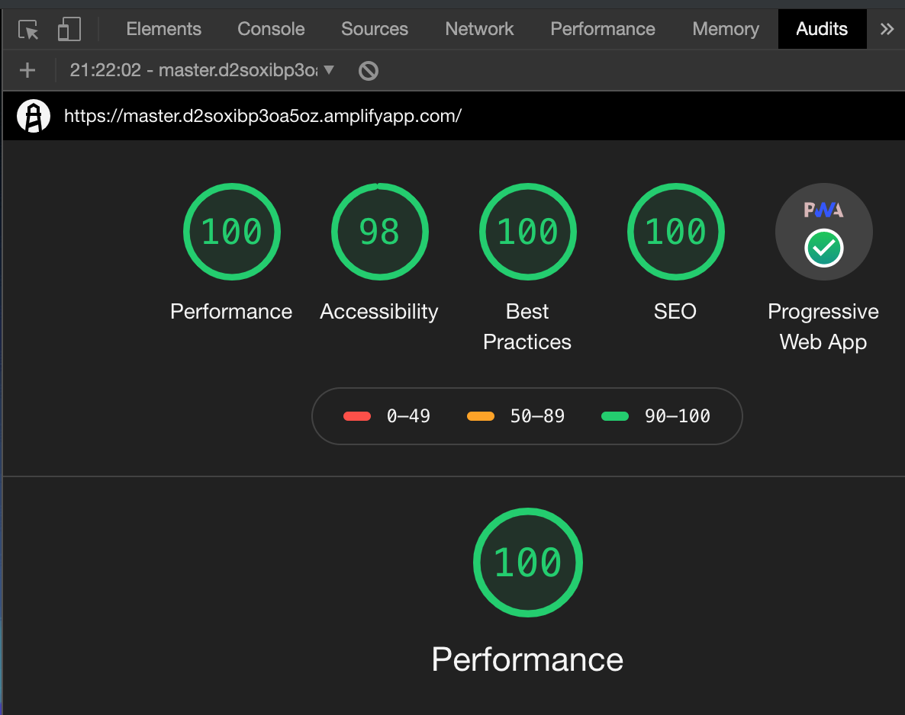

# Why? 
So it's not hard to build a slick website these days with template builders like [Squarespace](https://www.squarespace.com/), which i'd recommend for anyone looking to get going quickly, just another line on your credit card...

However on a noble quest to learn a few new frontend development skills and what the heck cool kids are doing in Javascript, i thought i'd build a modern blog and deployment pipeline ~ voila few weeks later i've learned tonnes that i'm proud to share. 

# Objectives

Whilst lacking in UX/UI design skills  - i still hold myself to an unreasonably high standard on cost optimisation (tight a$$), web performance and security. 

1. **Lowest possible cost** -  to build and host as static site
1. **Fastest possible performance** - make any CDN guru smile
1. **Secure** - no Wordpress SQL injection attacks please
1. **Mobile first** - no discussion required here
1. **Components based** - leverage best practices and get my head around React JS
1. **Easy** - at least to maintain and update content with a modern DevOps CI/CD pipeline

# The Solution

> * [Gatsby JS](https://www.gatsbyjs.org/)
> * [AWS Amplify](https://aws.amazon.com/amplify/)
> * Markdown on Github

It'd be easy to spend months just reviewing all the latest web frameworks and tools - it's clear the world has moved on from my old friend Wordpress. Though arguably Wordpress headless CMS is the way to go until [JAMstack CMS]() gets out of beta at least

It quickly became clear that [JAM stack](https://jamstack.org/) is where it's all at now - see [Smashing](https://www.smashingmagazine.com/2019/06/jamstack-fundamentals-what-what-how/)

Looking into all these hot new JS projects - [VueJS](https://vuejs.org/), [Hugo](https://gohugo.io/) and [Nuxt](https://nuxtjs.org/) - i stumbled on Gatsby JS and haven't looked back. A comparison between frameworks is [here](https://www.gatsbyjs.org/features/jamstack/gatsby-vs-nextjs-vs-nuxtjs)

So [Gatsby JS framework](https://www.gatsbyjs.org/) is my weapon of choice and the delightful documentation meant i was up and running faster then i imagined (but still embarressingly slow for any real frontend Dev)

# Results
So after a lot of trial and error (aka the beauty of forking someone elses hard work off Github) - nailed it! These results i reckon speak for themselves

## Ludicrous Fast - 100% Lighthouse score
Perfect performance audit score of 100% - earns real cred here from serious Web Dev's!! 

If you haven't discovered in Chrome Developer mode - [Lighthouse](https://developers.google.com/web/tools/lighthouse) is free and useful to benchmark any site as well as simulating slower networks (3G/4G) using throttling

Google SEO does favour performance and plenty of reseach on users attention span for page loads being far shorter then any goldfish 

## Free

The beauty of Github! Having decided on a framework, there is certainly no shortage of far cleverer folks with beautiful templates just needing CSS tweaks. Kudos to [Greg Lobinski](https://github.com/greglobinski/gatsby-starter-hero-blog) which i forked as the basis to get familiar and site running fast with heaps of useful web components baked in.

Settled on Hosting with [AWS Amplify](https://aws.amazon.com/amplify/) which conveniently made deployment a breeze - highly recommending reviewing for any CI/CD pipelines - not too long ago this was the domain of the DevOps superstar. Today - its free and fast. Having said that [Netlify](https://netlify.com) is absolutely amazing and i would consider if needed more dynamic content and wasn't so vain about leaving options open for CDN configuration and DevOps processes.

Hosting a Progressive Web App using AWS Amplify is effectively dumb storage (a S3 bucket with HTTP server) with Cloudfront CDN - at the modest volumes this site gets (ok make that miniscule), the bill if any is in  cents per month.

## Secure

The short version is that Gatsby is ridiculously secure and any vulnerabilities do get patched 

Enjoy this guide to [Gatsby security](https://www.gatsbyjs.org/blog/2019-04-06-security-for-modern-web-frameworks/) but the key point is that static sites using API (headless CMS) is a bulletproof architecture. 

Cloudfront TLS all the way and should i need more complex WAF rules, can easily apply to Cloudfront

## Mobile First

The beauty of jumping on board Gastsby is it's mobile friendly from ground up, V2 includes layout features and from my perspective it's a matter of picking styled examples from any of the growing list of starters at 

```javascript
import { createMuiTheme } from "material-ui/styles";
import Color from "color";
import colors from "./colors";
```

## Easy to update

All blog content is just Markdown which is compiled dynamically by Gatsby into a page

This means that my CMS is effectively Github - i can draft changes locally and merge into staging, then master. AWS Amplify picks up the changes and Gatsby framework auto renders new content. Could not be easier, bonus being i'm now getting familiar with Markdown.

# Annex 

Full credit to [HeroBlog](https://github.com/greglobinski/gatsby-starter-hero-blog), a [GatsbyJS](https://www.gatsbyjs.org/) starter.

### Features included

* Easy editable content in **Markdown** files (posts, pages and parts)
* **CSS** with `styled-jsx` and `PostCSS`
* **SEO** (sitemap generation, robot.txt, meta and OpenGraph Tags)
* **Social** sharing (Twitter, Facebook, Google, LinkedIn)
* **Comments** (Facebook)
* **Images** lazy loading and `webp` support (gatsby-image)
* Post **categories** (category based post list)
* Full text **searching** (Algolia)
* **Contact** form (Netlify form handling)
* **RSS** feed
* 100% **PWA** (manifest.webmanifest, offline support, favicons)
* Google **Analytics**
* App **favicons** generator (node script)
* Easy customizable base **styles** via `theme` object generated from `yaml` file (fonts, colors, sizes)
* React **v.16** (gatsby-plugin-react-next)
* **Components** lazy loading (social sharing)
* **ESLint** (google config)
* **Prettier** code styling
* Webpack `BundleAnalyzerPlugin`
